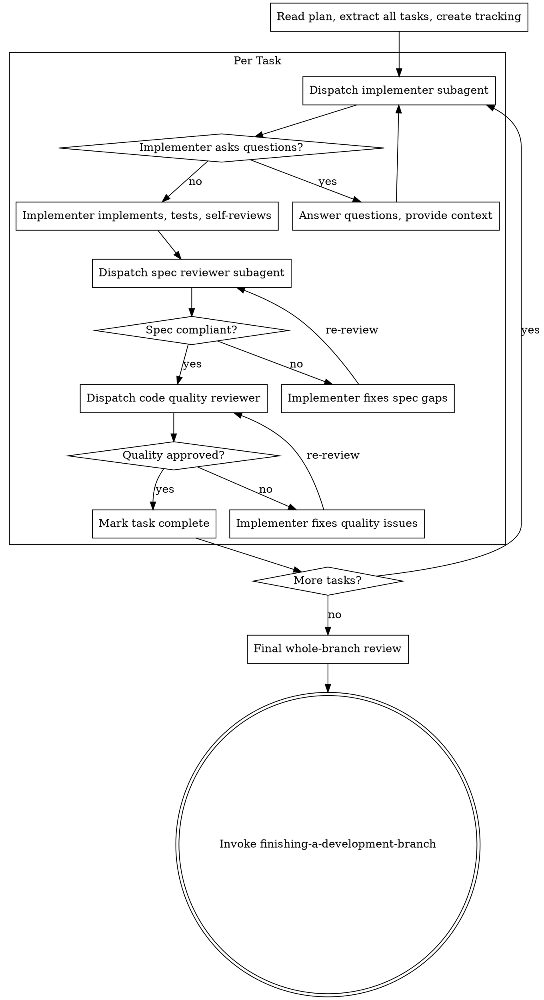

# Subagent-Driven Development (SDD)

Orchestrate specialists. Isolate context. Scale execution.

## Iron Laws
- **Fresh Sub-agent Per Task**: Zero context leakage between implementation units.
- **Two-Stage Review Mandatory**: Spec Compliance FIRST, Code Quality SECOND.
- **Parallel Waves Default**: If tasks are disjoint, dispatch simultaneously in one turn.
- **No Skill Leakage**: Sub-agents MUST NOT invoke skills. Only task execution.

## The Operational Flow

1.  **Read & Extract**: Parse the `plan.md` into atomic tasks.
2.  **Parallel Wave Grouping**: 
    - Group tasks by file-disjointness.
    - Dispatch a "Wave" of 3-5 sub-agents in a **single tool-call response**.
3.  **Review Gates**:
    - **Stage 1 (Spec)**: `spec-reviewer` confirms implementation matches plan.
    - **Stage 2 (Quality)**: `code-quality` checks structural debt and standards.
    - *Loop:* If fails, return to implementer immediately.
4.  **Integration**: Run full suite after wave completion.
5.  **Finalize**: Invoke `finishing-a-development-branch`.

## E2E Hygiene (Standard)
Before starting any service, sub-agents must:
1. `pkill` existing instances.
2. Verify port is free (`lsof -i`).
After finish:
1. Stop the service.
2. Verify cleanup (`pgrep`).

## Status Handling
- **DONE**: Proceed to Spec Review.
- **DONE_WITH_CONCERNS**: Audit concerns before review.
- **BLOCKED**: Re-dispatch with higher model (Opus) or escalate to Zeus Core.

## Rationalization Table

| Temptation | Danger |
| :--- | :--- |
| "I'll implement Task 1 and 2 together" | Context pollution. Logic bleed. |
| "Skip Spec Review, I trust this model" | Trust is not a quality gate. Evidence is. |
| "Dispatch one agent at a time" | Wastes 80% of wall-clock time and doubles token costs. |

Execute a plan with fresh subagents per task and strict review gates.

## Required Start

Announce: `I'm using subagent-driven-development to execute this plan.`

## Core Flow



1. Read the plan once and extract all tasks.
2. Create task tracking for all tasks.
3. For each task:
- Dispatch implementer subagent with full task text and minimal required context.
- Resolve implementer questions before coding.
- Require implementer verification evidence.
- Run spec-compliance review.
- If spec fails, return to implementer and re-review.
- Run code-quality review.
- If quality fails, return to implementer and re-review.
- Mark task complete: update the task’s checkbox in plan.md from `- [ ]` to `- [x]`. If `state.md` exists with a plan status section, update it to reflect the completed task.
   - For complex or high-risk tasks, validate the approach against requirements and consider simpler alternatives before or after the implementer’s work.
   - For tasks centered on frontend/UI, apply `frontend-design` standards to guide structure, styling, and accessibility.
4. Run final whole-branch review.
5. Invoke `finishing-a-development-branch`.

## Parallel Waves (default for independent tasks)

When tasks are independent and touch disjoint files, dispatch them as a wave — this is the preferred mode, not a special case. Sequential execution is the fallback for dependent tasks, not the default.

**Decision rule:** Before starting execution, group tasks into waves based on file overlap and state dependencies. Tasks with no shared files and no sequential dependency belong in the same wave.

1. Build a wave of independent tasks.
2. Dispatch all implementers in a **single message** with multiple parallel Agent tool calls. Do not stagger across multiple messages.
3. Review each task with the same two-stage gate.
4. Run integration verification after the wave completes.
5. Update all completed task checkboxes in plan.md (`- [ ]` → `- [x]`) and sync state.md if present.
6. Proceed to the next wave.

**Why single-message dispatch matters for cost:** All subagents share the same cached system prompt prefix. Dispatching them simultaneously in one message means every agent gets a cache hit on that prefix and only pays for its small unique task prompt. Staggered dispatch provides no additional benefit and wastes wall-clock time.

## E2E Process Hygiene

When dispatching subagents that start background services (servers, databases, queues):

Subagents are stateless — they do not know about processes started by previous subagents. Accumulated background processes cause port conflicts, stale responses, and false test results.

Include in the subagent prompt for any E2E or service-dependent task:

**Unix/macOS:**
```
Before starting any service:
1. Kill existing instances: pkill -f "<service-pattern>" 2>/dev/null || true
2. Verify the port is free: lsof -i :<port> && echo "ERROR: port still in use" || echo "Port free"

After tests complete:
1. Kill the service you started.
2. Verify cleanup: pgrep -f "<service-pattern>" && echo "WARNING: still running" || echo "Cleanup verified"
```

**Windows:**
```
Before starting any service:
1. Kill existing instances: taskkill /F /IM "<process-name>" 2>nul || echo "No existing process"
2. Verify the port is free: netstat -ano | findstr :<port> && echo "ERROR: port still in use" || echo "Port free"

After tests complete:
1. Kill the service you started.
2. Verify cleanup: tasklist | findstr "<process-name>" && echo "WARNING: still running" || echo "Cleanup verified"
```

Exception: persistent dev servers the user explicitly keeps running — document them in `state.md`.

## Handling Implementer Status

Implementer subagents report one of four statuses. Handle each appropriately:

**DONE:** Proceed to spec compliance review.

**DONE_WITH_CONCERNS:** The implementer completed the work but flagged doubts. Read the concerns before proceeding. If the concerns are about correctness or scope, address them before review. If they're observations (e.g., "this file is getting large"), note them and proceed to review.

**NEEDS_CONTEXT:** The implementer needs information that wasn't provided. Provide the missing context and re-dispatch.

**BLOCKED:** The implementer cannot complete the task. Assess the blocker:
1. If it's a context problem, provide more context and re-dispatch with the same model.
2. If the task requires more reasoning, re-dispatch with a more capable model.
3. If the task is too large, break it into smaller pieces.
4. If the plan itself is wrong, escalate to the user.
5. If the user is unavailable and the task is non-critical: document the block in `state.md` and advance to the next independent task.

**Never** ignore an escalation or force the same model to retry without changes. If the implementer said it's stuck, something needs to change. Never silently skip or mark a blocked task complete.

## Hard Rules

- Do not execute implementation on `main`/`master` without explicit user permission.
- Do not skip spec review.
- Do not skip quality review.
- Do not accept unresolved review findings.
- Do not ask subagents to read long plan files when task text can be passed directly.

## Context Isolation

Never forward parent session context or history to subagents. Construct each subagent's prompt from scratch using only:
- Task text
- Acceptance criteria
- Needed file paths
- Relevant constraints

Exclude unrelated prior assistant analysis and old failed hypotheses. Subagents must not receive conversation history, prior reasoning chains, or context from other subagent runs.

**Why this is also the cache-optimal approach:** All subagents share the same system prompt prefix, which the API caches. Keeping each subagent's input as `[cached system prompt] + [small unique task prompt]` means every agent hits the cache for the heavy shared prefix and only pays full input token price for its small task-specific tail. Forwarding parent conversation history would make each subagent's prefix unique, breaking cache sharing and multiplying input costs across the wave.

## Subagent Skill Leakage Prevention

Subagents can discover opencode-zeus skills via filesystem access and invoke them, causing a focused implementer to behave as a workflow orchestrator. Every subagent prompt MUST include this instruction:

> You are a focused subagent. Do NOT invoke any skills from the opencode-zeus plugin. Do NOT use the Skill tool. Your only job is the task described below.

## Model Selection for Agent Tool Calls

Choose model based on task type when dispatching subagents via the Agent tool:

| Model | Use for |
|---|---|
| `haiku` | File reads, summarization, log scanning, patch verification — output is data, not decisions |
| `sonnet` | Default for all implementation tasks |
| `opus` | Architecture analysis, complex spec review, multi-system debugging, any task requiring reasoning across many constraints at once |

Apply via the `model` parameter in Agent tool calls. Default to `sonnet` when uncertain. Only upgrade to `opus` when the task is genuinely reasoning-heavy — not just large.

## Prompt Templates

Use:
- `./implementer-prompt.md`
- `./spec-reviewer-prompt.md`
- `./code-quality-reviewer-prompt.md`

## Integration

- Setup workspace first with `using-git-worktrees`.
- Use `requesting-code-review` templates for quality review structure.
- Finish with `finishing-a-development-branch`.
